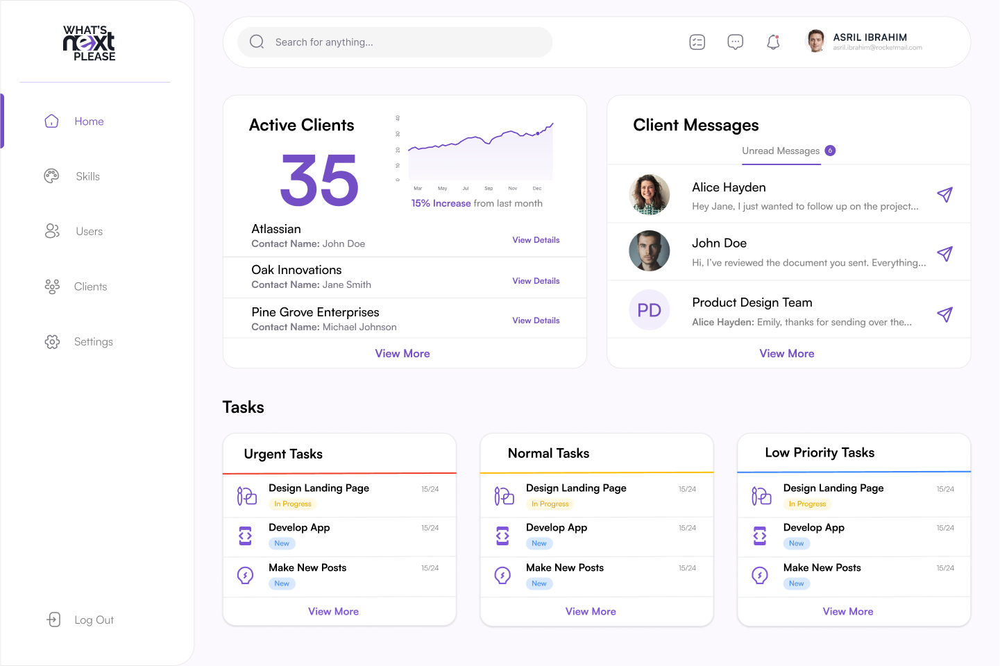

# 🚀 Sibteali Baqar - Portfolio

A modern, responsive portfolio website showcasing full-stack development projects, open-source contributions, and technical expertise.

**Live Site:** [portfolio](https://sibteali-portfolio.vercel.app)



## ✨ Features

- **Responsive Design** - Optimized for desktop, tablet, and mobile
- **Clean URLs** - SEO-friendly routing via Vercel
- **Fast Performance** - Static site with optimized assets
- **Accessible** - WCAG compliant navigation and markup
- **Modern UI** - Contemporary design with smooth animations

## 🛠️ Tech Stack

- **Frontend:** HTML5, CSS3, JavaScript
- **Styling:** Custom CSS with Webflow integration
- **Deployment:** Vercel
- **Version Control:** Git & GitHub

## 📂 Project Structure
```
portfolio/
├── index.html              # Home page
├── about.html              # About page
├── projects.html           # Projects listing
├── contact.html            # Contact page
├── projects/               # Individual project pages
│   ├── zen.html
│   ├── huffman-compressor.html
│   ├── real-time-chat.html
│   └── whats-next-please.html
├── css/                    # Stylesheets
├── js/                     # JavaScript files
├── images/                 # Image assets
├── vercel.json             # Vercel configuration
└── README.md
```

## 🎯 Featured Projects

### [Zen Browser Contributions](./projects/zen.html)
Open-source UI contributions to modern browser development
- **Tech:** JavaScript, Systems Programming
- **Role:** Active contributor

### [Huffman Compressor](./projects/huffman-compressor.html)
Lossless file compression implementing Huffman coding algorithm
- **Tech:** Go, Data Structures, Binary Trees
- **Features:** Streaming I/O, custom priority queue with generics

### [Real-Time Chat](./projects/real-time-chat.html)
Full-featured messaging platform with authentication
- **Tech:** Node.js, WebSockets, React
- **Features:** File sharing, rich text editor, real-time messaging

### [What's Next Please](./projects/whats-next-please.html)
Team task management and collaboration platform
- **Tech:** Next.js, TypeScript, PostgreSQL
- **Features:** Skill matching, priority levels, email notifications

## 🎨 Design Credits

- **Design:** [Influx Digital](https://www.influxdigital.com/)
- **Platform:** Webflow
- **Icons:** Custom SVG icons
- **Fonts:** Inter, Manrope (Google Fonts)

## 📧 Contact

- **Email:** sibteali786@gmail.com
- **GitHub:** [@sibteali786](https://github.com/sibteali786)
- **LinkedIn:** [Syed Sibteali Baqar](https://www.linkedin.com/in/syed-sibteali-baqar/)
- **Twitter:** [@SibtealiN](https://twitter.com/SibtealiN)
- **Medium:** [@sibteali786](https://medium.com/@sibteali786)

## 📄 License

This project is open source and available under the [MIT License](LICENSE).

## 🙏 Acknowledgments

- Design template by Influx Digital
- Powered by Webflow
- Deployed on Vercel
- Icons from custom SVG library

---

**Built with ❤️ in Islamabad, Pakistan**

*Working with clients globally to build scalable software solutions*
